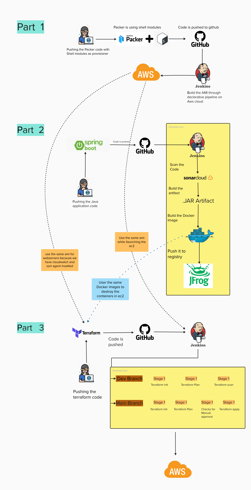
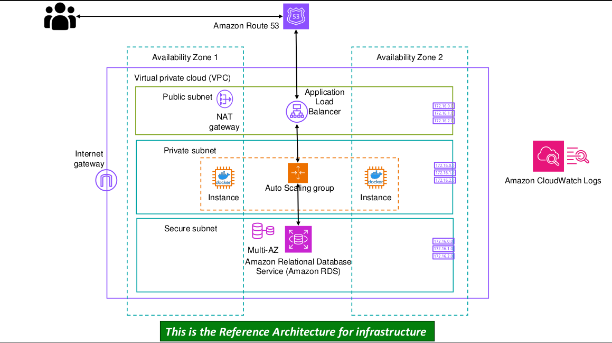
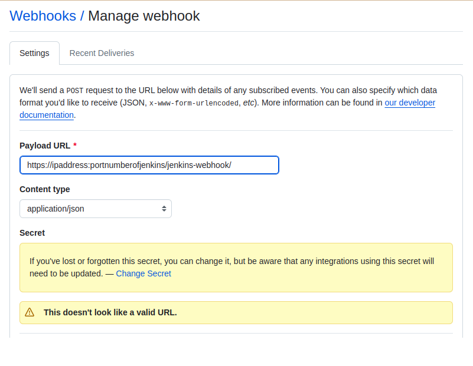

# Deployin Infrastructure using Terraform

  
Architecture

   
  
  

Steps followed to create the project

 

Create GitHub repository
 
We will create a GitHub repository for Part One. This repository will serve as a central hub for developers to easily interact with the              project and manage their contributions. It will also provide a solid anchor for our Jenkins pipeline, ensuring smooth integration and               continuous deployment processes. By utilizing GitHub, we promote collaboration, version control, and transparency within the team,                   enhancing overall productivity and project management.   

   

Launch an ec2
 
We will create an EC2 instance on AWS and set up the project there. This way, the project setup won’t interfere with our local machines, and our      local setups won’t affect the project. By isolating the environment, we ensure a clean and consistent setup for everyone involved, making it easier to manage dependencies and configurations. Additionally, this approach allows for better scalability and flexibility as we can easily         replicate the environment or scale resources as needed.  

1. Install Jenkins on the Instance.  
<pre><code>  
sudo apt update
sudo apt install openjdk-11-jdk
java --version
wget -p -O - https://pkg.jenkins.io/debian/jenkins.io.key | sudo apt-key add -
sudo sh -c 'echo deb http://pkg.jenkins.io/debian-stable binary/ > /etc/apt/sources.list.d/jenkins.list'
sudo apt update
sudo apt install jenkins
sudo systemctl status jenkins
sudo systemctl start jenkins
</code> </pre> 

2. Install Terraform on the Instance.  
<pre><code> 
sudo apt-get update
sudo apt-get install -y gnupg software-properties-common
wget -O- https://apt.releases.hashicorp.com/gpg | sudo gpg --dearmor -o /usr/share/keyrings/hashicorp-archive-keyring.gpg
echo "deb [signed-by=/usr/share/keyrings/hashicorp-archive-keyring.gpg] https://apt.releases.hashicorp.com $(lsb_release -cs) main" | sudo tee /etc/apt/sources.list.d/hashicorp.list
sudo apt-get update
sudo apt-get install terraform
terraform -v
</code> </pre> 

Integrating Github with Jenkins with the help of webhooks
 
1. Go to GitHub Dashboard >> Repository >> Settings >> webhook 
2. fill the payload URL as https://localhost:portnumber/jenkins-webhook/ , content type 
3. Click on Update webhook 
  

**Note:** We have used Ngrok as a server proxy as my instance is running on localhost and is inaccessible to the internet.

Steps to run ngrok on your machine:

1. Download the ngrok
2. run the command: ngrok HTTP (port number)
3. it will give you a URL which will be accessible from the internet.
4. copy the URL and paste it into the webhook.
5. https://1443-103-47-14-188.ngrok-free.app/multibranch-webhook-trigger/invoke?token=my-secret-token

Jenkins File
 

Path to the Jenkinsfile file: <a href = "./Jenkinsfile"> Jenkinsfile</a>

  

  
Launch Jenkins and Create a Pipeline with the following stages
 
  
Path to the Provisioner file: <a href = "./Jenkinsfile"> Jenkinsfile</a>

  Steps followed: 
    1. Create a Jenkins job with the following configurations:  
      &nbsp;a. Item Type: Multibranchpipeline 
      &nbsp;b. Branch Source: Git, give your git repo URL, Property strategy: all branches get the same properties, Build Configuration: 
      Jenkinsfile, 
      Scan Multibranch Pipeline Trigger: scan by webhook, give the trigger token and follow the steps in github  
    2. Install the following plugins: GitHub Plugin, GitHub Branch Source Plugin,Pipeline Plugin, Multibranch Pipeline Plugin, SonarQube Scanner 
    Plugin, JFrog Artifactory Plugin, Docker Plugin, Docker Pipeline Plugin:  
    3. Creta a credential in Jenkins to store the  AWS access key and secret key as username and password also pass the ID, similarly for docker and 
   jfrog   
    4. Build the pipeline if no errors occur we will be able to find an ami in the location specified.
  
  

  

  
Check for the Architecture created by the pipeline in the AWS console.
 
     we will be able to find the architecture in the aws and able to access instances from the load balancer given IP.
 

 
  

Reference to the other parts of the Parts.
|[Part 0](https://github.com/AnirudhBadoni/ProjectOne.git)|[Part 1](https://github.com/AnirudhBadoni/Packer.git)|[Part 2](https://github.com/AnirudhBadoni/Petclinic.git)|
|---|---|---|
